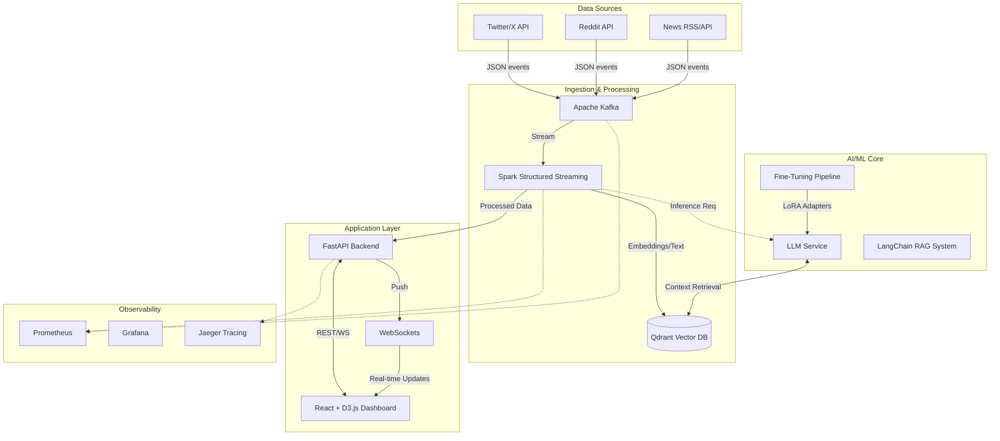

# System Architecture

## Overview
This platform is a comprehensive Real-Time Sentiment Analysis system designed to demonstrate advanced capabilities in streaming data processing, Large Language Model (LLM) engineering (Fine-tuning & RAG), and Kubernetes-native operations. It monitors social media and news feeds, analyzes sentiment and topics in real-time, and provides actionable insights via an interactive dashboard.

## Technical Goals
- **Real-Time Processing**: Sub-second latency from ingestion to insight using Apache Spark Structured Streaming.
- **Advanced NLP**: Domain-adaptation of small LLMs (Google Gemma 2B or Microsoft Phi-2) via QLoRA fine-tuning.
- **Scalability**: Event-driven microservices architecture managed by Kubernetes.
- **GitOps**: Declarative infrastructure and application state management using FluxCD.

## High-Level Architecture

## Component Details

### 1. Data Ingestion & Streaming (Apache Kafka & Spark)
- **Kafka**: Acts as the central nervous system. Topics are partitioned by data source (e.g., `tweets`, `reddit-posts`).
- **Spark Structured Streaming**: Consumes from Kafka, applies cleaning, deduplication, and preliminary sentiment scoring (using lightweight NLP models before sending complex tasks to LLM).

### 2. Machine Learning & LLMs
- **Model**: **Google Gemma 2B** or **Microsoft Phi-2** (quantized to 4-bit).
- **Fine-Tuning**:
    - **Method**: QLoRA (Quantized Low-Rank Adaptation) to run on single 6GB GPU.
    - **Library**: `unsloth` for accelerated training or `peft` + `bitsandbytes`.
    - **Goal**: Tune the model to understand brand-specific context and "crisis" terminology better than base models.
- **RAG (Retrieval Augmented Generation)**:
    - **LangChain/LangGraph**: Orchestrates retrieval of similar historical contexts from Qdrant to aid the LLM in classification and response generation.
    - **Embeddings**: `sentence-transformers` (e.g., `all-MiniLM-L6-v2`) for fast, efficient vector generation.

### 3. Backend (FastAPI)
- **API**: RESTful endpoints for dashboard data (historical trends, aggregation).
- **WebSockets**: Real-time push notifications for new "Crisis" alerts or trend shifts.
- **Asynchronous**: Built on `asyncio` to handle high-concurrency requests and prolonged stream connections.

### 4. Frontend (React + D3.js)
- **Visualizations**: D3.js for complex, custom visualizations (Geothermal maps, Word Clouds).
- **Components**: Recharts for standard time-series data.
- **State**: React Query for data fetching and caching.

### 5. Infrastructure (Kubernetes & GitOps)
- **Cluster**: Kubernetes (Local: Kind/Minikube, Cloud: GKE/EKS).
- **Operators**:
    - `Strimzi`: Manages Kafka clusters.
    - `SparkOperator`: Manages Spark applications.
- **CD**: FluxCD monitors the `sentiment-analysis-gitops` repository and reconciles the cluster state.

## Decision Matrix

| Component | Choice | Rationale |
|-----------|--------|-----------|
| **Streaming** | Spark Structured Streaming | Robust specifically for micro-batch processing which is easier to reason about for aggregations than Flink for this use case. |
| **Vector DB** | Qdrant | High performance, Rust-based, excellent developer experience and filtering capabilities. |
| **LLM Inference** | vLLM or CTranslate2 | optimized inference for quantized models on consumer hardware. |
| **Observability**| Prometheus/Grafana/Jaeger | The standard cloud-native stack. Easy integration with K8s. |
